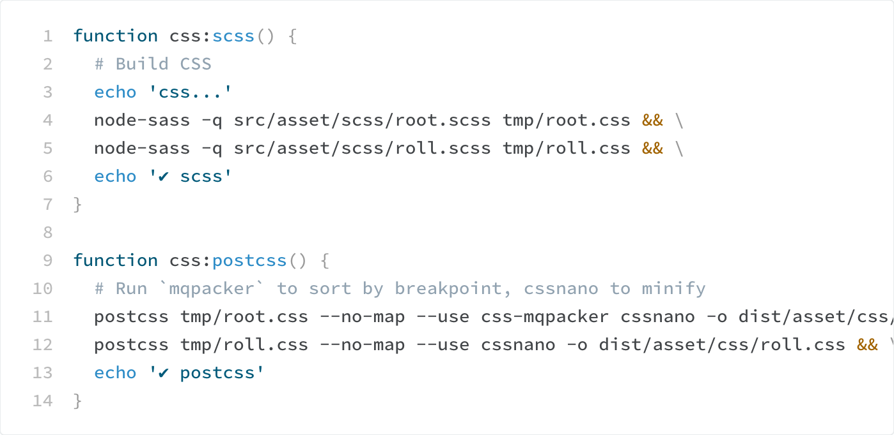

# CSS line numbers
Add line numbers code samples without JavaScript. 

[Example](https://tomgenoni.github.io/css-line-numbers/) 

## Problem

Markdown support for code blocks is simple and works well. Surround samples with three back ticks and the conversion works its magic.

```css
.car {
  color: red;
}
```

But it’s nice to able to reference specific line numbers and all the options I know of —CodeMirror, Github Gist embed, custom scripts—involve client-side JavaScript. 

## Solution

This approach uses some special characters to populate a `content` property. 



### Features

1. Line numbers for code samples 200 lines. You can increase this to any length you need. 
2. Lines wider than container will scroll while keeping line numbers visible.
3. Styles any code blocks using `<pre><code>…</code></pre>`. This is Markdown’s default.

## Usage

1. Download [line-numbers.css](https://github.com/tomgenoni/css-line-numbers/blob/master/line-numbers.css).
2. Adjust the variables as needed. 

### Recommended

Use it with [Prism](https://prismjs.com/) or another syntax highlighter to increase code readability. I [add it](https://github.com/tomgenoni/genoni-dev/blob/master/app/content.js#L20) in the build step and use with a custom theme on my  [personal site](https://genoni.dev/write/building-genoni-dev.html). 

## Notes 

1. This approach does not programmatically link line numbers with the code example. To provide an accessible experience you should provide more context when referencing a line number.
2. You may need to increase the `--code-spacer` value if you're using a large-ish font for the line-numbers.
